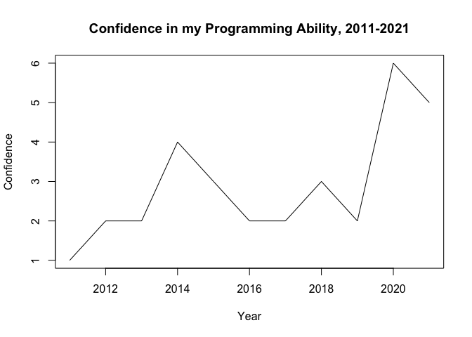

Programming Background
================
Ilana Feldman
9/13/2021

``` r
rmarkdown::render("./_Rmd/2021-9-13-ST558-Second-Blog.Rmd",
                  output_format = "github_document",
                  output_dir = "./_posts/",
                  output_options = list(html_preview = FALSE)
)
```

## Constant Programming Shifts

I feel like I’ve started learning to program half a dozen times at this
point. One of my first experiences was with an AoPS class on Python,
only for me to completely abandon it after finishing. When I arrived at
college, one of my first classes introduced MatLab, but another class
that I had decided to take turned out to require advanced knowledge of
MatLab and didn’t reveal that until halfway through. Although I withdrew
from the latter class, I later enrolled in a Java class that listed the
introductory MatLab class as one of two possible prerequisites. This
turned out to be a horrible oversight by my university, however, because
it was an intermediate Java class and I had zero experience with Java.
Although these experiences scared me off of programming for a while, I
was eventually forced to start from the beginning again due to my
graduate program requiring an introductory course on SAS. Several of my
classes after that also expected basic knowledge of R to complete them,
and I’ve tried to learn at least a little assembly language for my side
projects in the last year, although my knowledge of this is still
insufficient to be very useful.

Technically, I started to learn R shortly after I graduated college, as
I was preparing to enter the Actuarial field immediately and wanted some
programming knowledge under my belt that didn’t feel horribly confusing.
However, plans changed very suddenly, and due to my experiences with
Java and MatLab, I wasn’t prepared to start learning another language,
even though R didn’t seem too difficult on the outset. When I was forced
to learn some of it for my other classes, I entered very cautiously,
sticking very closely to the example code and not exploring very much.
However, it was fairly easy to run said example code and see exactly
what it did and how it functioned. At least on a surface level, it’s
very easy to try different things and figure out how bits and pieces
work together.

At this point, it’s been long enough that I don’t remember too many
details of Python, Java, MatLab, or the other languages I “started to
learn programming” with, but I can safely say that I prefer R to just
about all of them. With the wide variety of packages out there and the
ability to quickly create my own functions, it’s very easy to customize
how I program, and it feels like there’s more creativity for how to find
solutions to problems that unexpectedly arise while I’m working. I’ve
even started to use R for some of my personal projects, which I haven’t
done with any other language other than assembly. Even SAS, which I’ve
grown to like during the classes that required it, feels clunkier and
like it has lower potential. While I do miss the languages I’ve
abandoned, that’s only because I never got to a level where I could see
the true potential of those languages.

## R Markdown Output

``` r
x <- c(2011, 2012, 2013, 2014, 2015, 2016, 2017, 2018, 2019, 2020, 2021)
y <- c(1, 2, 2, 4, 3, 2, 2, 3, 2, 6, 5)
plot(x, y, xlab = "Year", ylab = "Confidence", type = "l", main = "Confidence in my Programming Ability, 2011-2021")
```

<!-- -->
